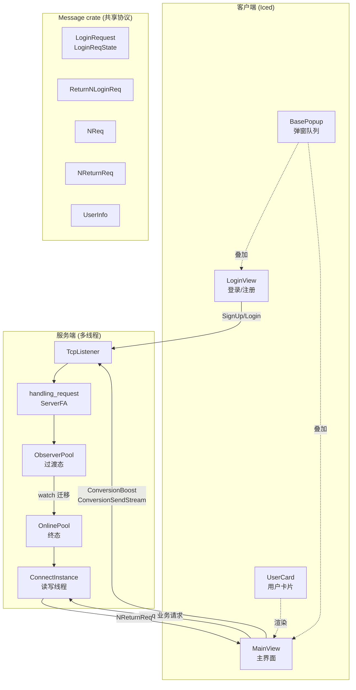
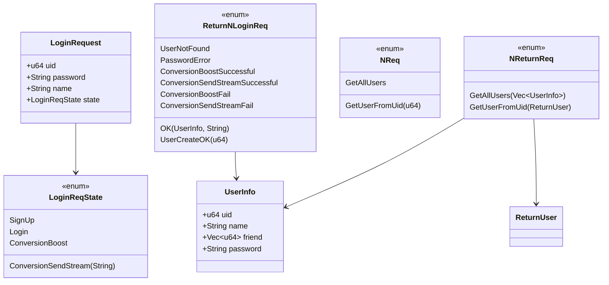
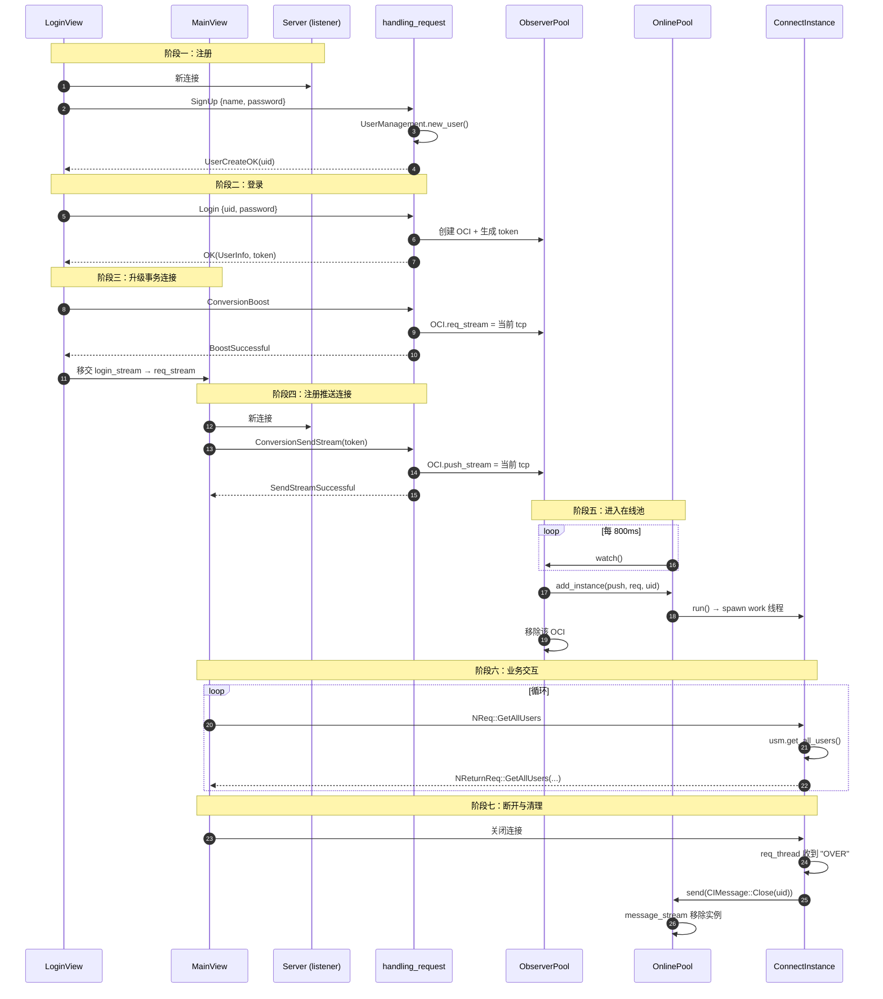
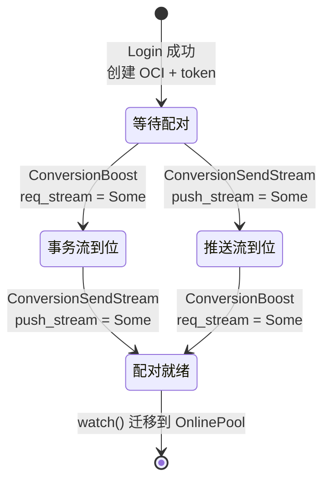
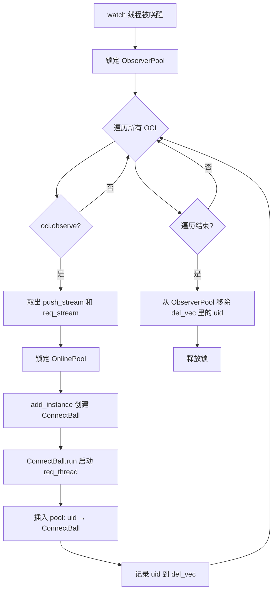
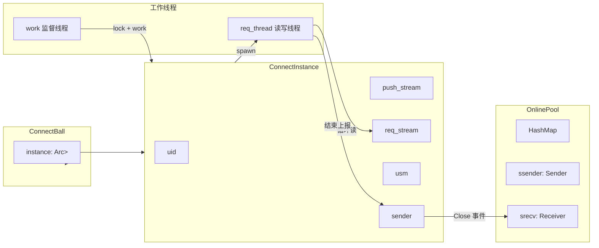
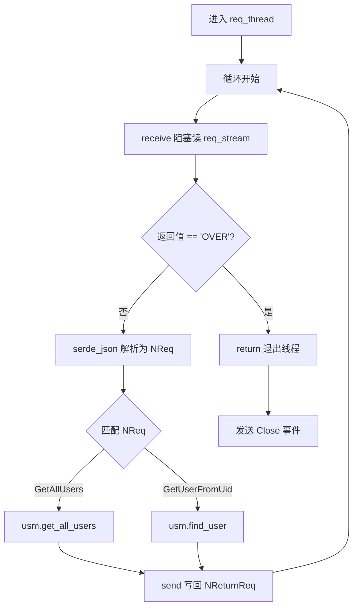
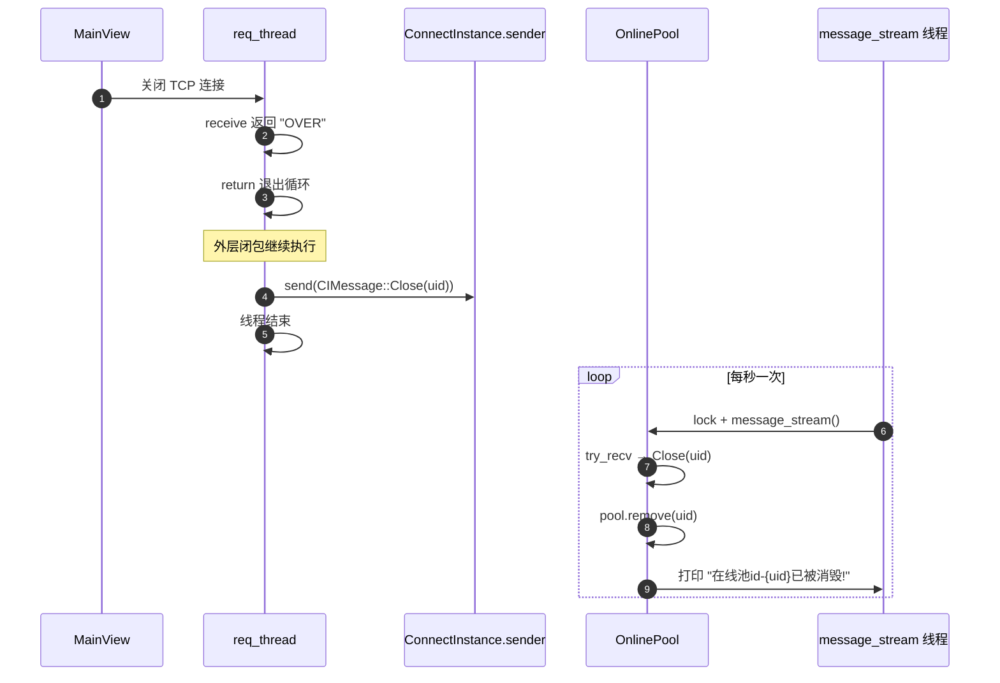
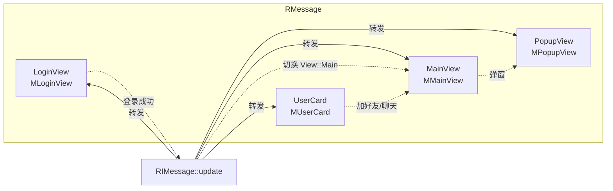
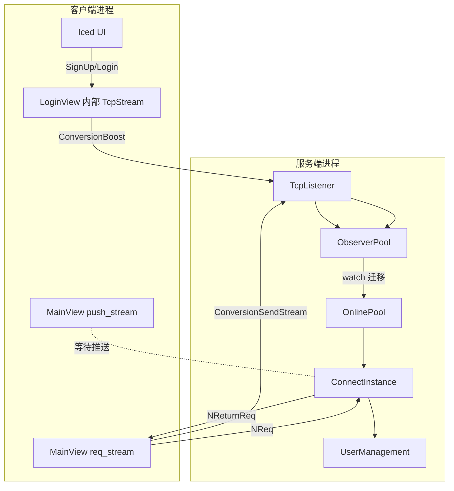

# RIMessage [开发中]

当前进度: `R1测试通过-验证“多个用户的连接能各自独立完成完整的生命周期”`

为了方便您对整个项目的流程架构的有一个大体理解，我使用了 **DeepSeek** 生成了以下图表来辅助理解

---

## 1. 总览架构

**解释**：客户端和服务端通过 `Message` crate 里定义的协议通信。客户端的 `LoginView` 负责注册和登录，`MainView` 负责后续的业务交互。服务端从 `TcpListener` 接连接，分派给 `handling_request` 处理握手，握手完成后进入 `ObserverPool`，配对成功后迁移到 `OnlinePool`，由 `ConnectInstance` 的工作线程负责日常读写。

---

## 2. 协议定义

**解释**：协议分成两条独立的“轨道”。

- **登录轨道**：`LoginRequest` + `ReturnNLoginReq`。所有“建立连接身份”的动作（注册、登录、升级事务流、注册推送流）都走这一条。
- **业务轨道**：`NReq` + `NReturnReq`。只有连接身份确立之后的日常请求才走这一条，比如拉取用户列表、查某个用户。

两条轨道分离的好处是：登录轨道处理完就结束，不用长期维护；业务轨道可以反复调用，不掺和认证逻辑。

---

## 3. 注册 → 登录 → 双连接握手（完整时序）

**解释**：整个握手分七个阶段。

前四个阶段是**客户端主动发起**的：注册 → 登录 → 升级事务流 → 注册推送流。每一次都是请求-响应模式，客户端发一条，服务端回一条。

第五阶段是**服务端内部**的：后台线程 `watch()` 每 800ms 扫一遍观察池，发现某人的两条流都到位了，就把它迁移到在线池，并启动工作线程。

第六阶段是**业务阶段**：客户端在事务连接上发业务请求，`ConnectInstance` 的 `req_thread` 收到后处理并返回。

第七阶段是**清理**：客户端断开后，`req_thread` 检测到 `"OVER"`，通过事件通道上报给 `OnlinePool`，`message_stream` 把实例从池子里移除。

---

## 4. 观察池：连接配对的状态机

**解释**：`ObserveConnectionInstance` 有三个状态。

- **等待配对**：刚创建，两条流都是 `None`。
- **事务流到位 / 推送流到位**：收到其中一条连接，但另一条还没到。
- **配对就绪**：两条流都是 `Some`，`observe()` 返回 `true`，下一轮 `watch()` 会把它迁移到 `OnlinePool`。

状态机的重点是：**两条流到达的顺序无关紧要**。先事务后推送、先推送后事务都可以，最终都能到达“配对就绪”。

---

## 5. 池迁移流程

**解释**：`watch()` 的核心逻辑是“先收集、再删除”。

遍历阶段：对每个 `OCI` 检查 `observe()`。如果就绪，`take` 出两条流，交给 `OnlinePool::add_instance`，同时把 uid 记进 `del_vec`。

清理阶段：遍历结束后，统一从 `observer_pool` 里删除 `del_vec` 里的所有 uid。

这种“两段式”写法避开了“边遍历边删除”的借用冲突，也避免了锁的嵌套问题。`add_instance` 里的锁只在“创建 ConnectBall + 插入 pool”这段短暂持有，`run()` 启动线程后立即返回，不会阻塞后续用户的迁移。

---

## 6. 在线池的线程模型

**解释**：这个图里有三个“层”的线程。

- **`work` 监督线程**：`ConnectBall::run` 里 spawn 的。它拿一下 `ConnectInstance` 的锁，spawn 出 `req_thread`，然后立即返回释放锁。它本身几乎不做事，是一个“启动器”。
- **`req_thread` 读写线程**：真正干活的线程。循环读 `req_stream`，解析 `NReq`，处理，写回 `NReturnReq`。客户端断开时循环退出。
- **`message_stream` 清理线程**：独立循环，通过 `try_recv` 检查 `srecv`，一收到 `Close(uid)` 就把该 uid 从 `pool` 里删除。

`sender` 是 `ConnectInstance` 持有的通道发送端。它在 `req_thread` 结束后发送 `Close(uid)`，触发清理。

---

## 7. `req_thread` 的内部循环

**解释**：`req_thread` 是一个同步的请求-响应循环。每次 `receive` 会阻塞等待一条消息，读到后解析、处理、写回，然后继续读下一条。

关键点是 `"OVER"` 这个哨兵值。`receive()` 在客户端断开时返回 `"OVER"`，此时线程直接 `return`，不解析、不处理。返回后，外层闭包会发送 `Close(uid)` 事件，通知 `OnlinePool` 清理。

`"OVER"` 用字符串是因为它不可能和任何合法 JSON 冲突——所有合法 `NReq` 都至少是 `"GetAllUsers"` 或 `{"GetUserFromUid": ...}` 这样的形式。

---

## 8. 断开清理时序

**解释**：断开清理分两段。

第一段在 `req_thread` 内部：读到 `"OVER"` 后 `return`。外层闭包不 join，直接往 `sender` 发 `Close(uid)`。

第二段在 `message_stream` 线程里：独立循环，每秒 `try_recv` 一次。收到 `Close(uid)` 就从 `pool` 里移除。移除后该用户的 `ConnectBall` 被 drop，其内部的 `Arc<Mutex<ConnectInstance>>` 引用计数归零，`ConnectInstance` 被释放，两个 `TcpStream` 自动关闭。

这样设计的好处是：**断开的检测和资源的释放是解耦的**。`req_thread` 只负责上报“我结束了”，`OnlinePool` 负责“删除注册”。即使 `req_thread` 和 `message_stream` 跑在不同的时间线上，也不会遗漏。

---

## 9. 客户端 UI 消息路由

**解释**：客户端用**嵌套消息**做组件间通信。

`RMessage` 是顶层枚举，每个变体装着一个子组件的消息枚举（`MLoginView`、`MMainView`、`MPopupView`、`MUserCard`）。`RIMessage::update` 本身不做业务，只做转发——把消息分派给对应的子组件。

子组件之间不直接通信，全部通过上层 `RIMessage` 中转。比如 `LoginView` 登录成功后，返回 `RMessage::Login(UserInfo)`，由 `RIMessage` 处理“切换视图 + 移交连接”。`MainView` 想弹窗，返回 `RMessage::PopupView(...)`，由 `RIMessage` 转发给 `BasePopup`。

这样每个子组件只需要知道自己内部的逻辑，不需要知道别的组件怎么工作。加新组件时，只需要在 `RMessage` 里加一个变体 + 在 `update` 里加一行转发。

---

## 10. 完整系统数据流

**解释**：这是整张系统的全景图。

客户端有三条 `TcpStream`：`LoginView` 的临时流（升级为 `MainView` 的 `req_stream`），和 `MainView` 新开的 `push_stream`。

服务端有两个池子：`ObserverPool` 是过渡态，`OnlinePool` 是终态。`watch()` 负责把前者迁到后者。

`ConnectInstance` 是业务核心，它同时持有 `req_stream`、`push_stream`、`usm`。目前只有 `req_stream` 被 `req_thread` 消费，`push_stream` 还处于待命状态——它是下一步实现“服务端主动推送”时的入口。

`push_stream` 的“等待推送”这条虚线是还没实现的部分：等好友系统、消息路由做出来之后，`ConnectInstance` 会从别的用户那里接收推送消息，然后写进 `push_stream` 发给目标客户端。
